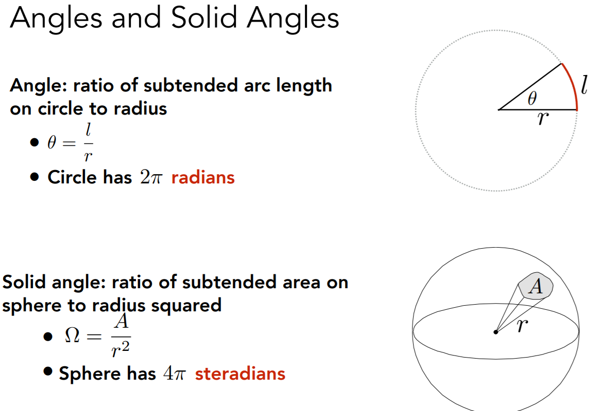
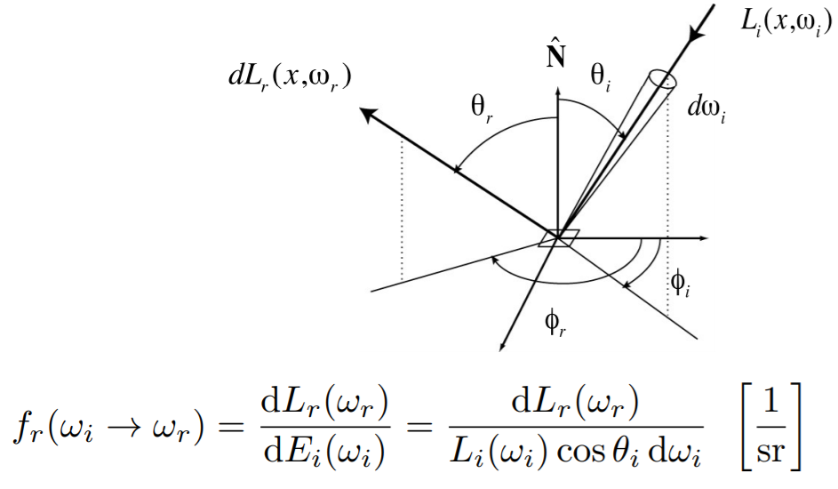
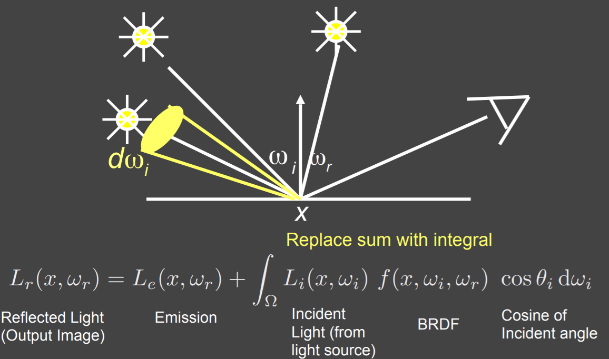

# Ray Tracing

### Why?

Rasterization Shading cannot handle global effect (e.g., soft shadow, multiple light sources, glossy reflection, indirect illumination).

Ray-tracing is slow, but can generate high quality shades.


### Whitted-Style Ray Tracing

Cast ray and trace the route recursively.


A ray is defined by origin $\mathbf o$ and direction $\mathbf d$ as a function of time $t \ge 0$:
$$
\mathbf r(t) = \mathbf o + t\mathbf d
$$
Ray-Surface intersection algorithm:

* Naïve: Check intersection with each triangles. (slow!)

* AABB (Axis-Aligned Bounding Boxes): 

  first check if ray hit object bounding box, then check intersection with the object triangles.

  Need to pre-compute bounding boxes by spatial partitioning (uniform grid, KD-tree) / object partitioning (bounding volume hierarchy).

  

  

### Basic Radiometry



Physically correct manner of light calculation.

**Radiant Energy**: $Q [J=Joule]$

**Radiant Flux**: $\Phi = \frac  {dQ} {dt} [W] [lm=lumen]$

**Radiant Intensity**: $I(\omega) = \frac {d\Phi} {d\omega} [W/sr] [cd=candela]$, power per solid angle.

**Irradiance**: $E(x) = \frac {d\Phi(x)} {dA} [W/m^2] [lux]$ power per unit area incident on  a surface point.

**Radiance/Luminance**: $L(p, \omega) = \frac {d^2\Phi(p, \omega)} {d\omega dA\cos\theta} [W/sr\ m^2] [nit]$ , power per unit solid angle per projected unit area. (or Irradiance per solid angle, or Intensity per projected unit area)

* Incident Radiance
* Exiting Radiance

Irradiance vs radiance: 


**Bidirectional Reflectance Distribution Function (BRDF)**: how much light is reflected into each outgoing direction from each incoming direction.



The Reflection Equation:


The Rendering Equation:




### Path Tracing

Whitted-Style Ray Tracing's assumptions are too simple (in fact wrong).

e.g. Glossy materials reflection, diffuse materials reflection.

We can numerically solve the rendering function by Monte Carlo Integration.

```bash
# Distributed Ray Tracing
shade(p, wo)
	Randomly choose N directions wi~pdf
	Lo = 0.0
	For each wi
		Trace a ray r(p, wi)
		If ray r hit the light
			Lo += (1 / N) * L_i * f_r * cosine / pdf(wi)
		Else If ray r hit an object at q
			Lo += (1 / N) * shade(q, -wi) * f_r * cosine / pdf(wi)
	Return Lo
```

But the #ray explodes after many bounces. Also, the recursion never ends (light never stop bouncing).

So we decide to **only choose one random direction** each time, and use Russian Roulette (RR) method to randomly stop light bouncing.

```bash
# Path Tracing (N == 1)
shade(p, wo, P_RR) # P_RR is a parameter to control RR stop.
	# Random stop 
	Randomly select ksi from U[0, 1].
	If ksi > P_RR
		Return 0
	# Random Path
	Randomly choose ONE direction wi~pdf(w)
	Trace a ray r(p, wi)
		If ray r hit the light
			Return L_i * f_r * cosine / pdf(wi)
		Else If ray r hit an object at q
			Return shade(q, -wi) * f_r * cosine / pdf(wi)
```

However, this randomness will be very noisy. 

So we trace multiple paths for each pixel and average them.

```bash
ray_generation(camPos, pixel)
	Uniformly choose N sample positions within the pixel
	pixel_radiance = 0.0
	For each sample in the pixel
		Shoot a ray r(camPos, cam_to_sample)
		If ray r hit the scene at p
			pixel_radiance += 1 / N * shade(p, sample_to_cam)
	Return pixel_radiance
```


